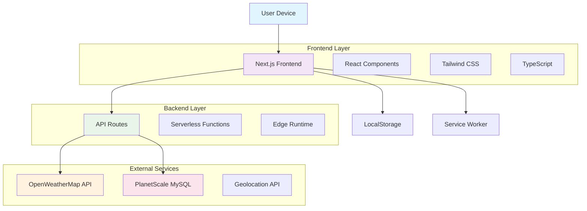

# ❄️ SkyKash Weather App ❄️

**SkyKash** is a beautiful, Kashmir-inspired Progressive Web App that delivers real-time weather forecasts with an immersive user experience. Built with modern web technologies, it combines elegant design with powerful functionality.


**Live Demo:** [https://skykash15.vercel.app](https://skykash15.vercel.app)

---

## 🚀 **Quick Start**

[](https://skykash15.vercel.app)

---

## ✨ **Features**

### 🌟 **Core Features**
- **Mandatory Newsletter Signup** - Personalized onboarding with name and email
- **Smart Premium User Detection** - Automatic redirection for premium users
- **Real-time Weather Data** - Accurate forecasts powered by OpenWeatherMap API
- **Location Detection** - Auto-detects user location for personalized weather
- **PWA Ready** - Installable app experience with offline capabilities

### 🎨 **User Experience**
- **Kashmir-Inspired Design** - Beautiful gradients reflecting Kashmir's natural beauty
- **Dark/Light Mode** - Theme persistence with user preference memory
- **Responsive Design** - Flawless experience across all devices
- **12-Hour Time Format** - User-friendly time display (AM/PM)
- **Smooth Animations** - Elegant transitions and hover effects

### 📱 **Advanced Features**
- **7+ Integrated Features**:
  - 🏔️ Kashmir Tourism Spotlight
  - 💨 Air Quality Index (AQI)
  - 🕌 Prayer Times & Islamic Calendar
  - 📈 Weather Trends & Forecasts
  - 🎯 Personalized Activity Recommendations
  - 🌍 World Weather Comparison
  - 🎨 Dynamic Theme System

### ⚡ **Technical Excellence**
- **Auto Location Detection** - Smart GPS-based location services
- **Theme Persistence** - Remembers user's theme preference
- **Install Prompt** - Smart PWA installation with timing optimization
- **Error Handling** - Comprehensive error management and user feedback

---

## 🛠 **Technology Stack**

### **Frontend**
- **Framework**: Next.js 14 with App Router
- **Language**: TypeScript
- **Styling**: Tailwind CSS with custom Kashmir theme
- **UI Components**: Custom React components
- **State Management**: React Hooks (useState, useEffect)
- **Icons**: Custom SVG and emoji icons

### **Backend**
- **Runtime**: Next.js API Routes
- **Deployment**: Vercel Edge Functions
- **Authentication**: LocalStorage-based session management
- **API Integration**: OpenWeatherMap API

### **PWA & Performance**
- **PWA Features**: Service Worker, Web App Manifest
- **Optimization**: Image optimization, lazy loading
- **Storage**: Browser LocalStorage for user preferences
- **Caching**: Strategic API response caching

### **Development Tools**
- **Package Manager**: npm
- **Version Control**: Git & GitHub
- **Linting**: ESLint with Next.js configuration
- **Building**: Next.js built-in compiler

---

## 📊 **System Architecture**



---

## 🗂 **Project Structure**

```
skykash/
├── app/                    # Next.js App Router
│   ├── api/               # API routes
│   │   ├── subscribe/     # Newsletter subscription
│   │   └── weather/       # Weather data fetching
│   ├── dashboard/         # Main application
│   ├── privacy/           # Privacy policy page
│   └── layout.tsx         # Root layout
├── components/            # React components
│   ├── Dashboard.tsx      # Main dashboard
│   ├── NewsletterSignup.tsx # Onboarding form
│   ├── WeatherCard.tsx    # Weather display
│   ├── Menu.tsx          # Navigation menu
│   └── [7 Feature Components]
├── hooks/                 # Custom React hooks
│   ├── useLocation.ts     # Geolocation hook
│   └── useDynamicTheme.ts # Theme management
├── types/                 # TypeScript definitions
│   └── weather.ts         # Weather data types
├── public/               # Static assets
│   ├── manifest.json     # PWA manifest
│   ├── sw.js            # Service worker
│   └── icons/           # App icons
└── configuration/        # Build configs
    ├── tailwind.config.js
    ├── next.config.js
    └── tsconfig.json
```

---

## 🔌 **API Endpoints**

| Endpoint | Method | Parameters | Response | Description |
|----------|--------|------------|----------|-------------|
| `/api/subscribe` | POST | `{email: string}` | `{message: string}` | Newsletter subscription |
| `/api/weather` | GET | `city` or `lat,lon` | Weather JSON | Weather data fetch |

### **Example Usage**
```javascript
// Subscribe to newsletter
const response = await fetch('/api/subscribe', {
  method: 'POST',
  headers: {'Content-Type': 'application/json'},
  body: JSON.stringify({email: 'user@example.com'})
});

// Get weather data
const weather = await fetch('/api/weather?city=Srinagar');
```

---

## 🎨 **UI/UX Design System**

### **Color Palette (Kashmir Inspired)**
- **Primary Blue**: `#87CEEB` - Kashmir sky
- **Primary Green**: `#2E8B57` - Valley greenery
- **Neutral Tones**: Soft grays for text and backgrounds
- **Gradients**: Blue-to-green transitions mimicking landscapes

### **Typography**
- **Primary Font**: Poppins (Headers & UI)
- **Secondary Font**: Lato (Content & paragraphs)

### **Components**
- **Cards**: Glass-morphism with backdrop blur
- **Buttons**: Gradient backgrounds with hover animations
- **Forms**: Clean, accessible input fields
- **Navigation**: Intuitive hamburger menu

---

## 📱 **PWA Features**

### **Installation**
- **Auto-prompt**: Appears after 8 seconds (mobile) / 6 seconds (desktop)
- **Manual trigger**: Available in settings menu
- **Smart dismissal**: Remembers user choice for 7 days

### **Offline Capabilities**
- Service worker caching for core assets
- Offline weather data fallback
- Installable home screen experience

### **Mobile Optimization**
- Touch-friendly interfaces
- Responsive grid layouts
- Mobile-specific gesture support

---

## 🚀 **Deployment**

### **Vercel Deployment**
```bash
# Install dependencies
npm install

# Build project
npm run build

# Deploy to Vercel
npx vercel --prod
```

### **Environment Variables**
```env
NEXT_PUBLIC_WEATHER_API_KEY=your_openweathermap_key
DATABASE_URL=your_planetscale_connection_string
```

---

## 🔧 **Development Setup**

1. **Clone Repository**
   ```bash
   git clone https://github.com/Saff9/SkyKash.git
   cd SkyKash
   ```

2. **Install Dependencies**
   ```bash
   npm install
   ```

3. **Environment Configuration**
   ```bash
   cp .env.example .env.local
   # Add your API keys to .env.local
   ```

4. **Run Development Server**
   ```bash
   npm run dev
   ```

5. **Build for Production**
   ```bash
   npm run build
   npm start
   ```

---

## 📈 **Performance Metrics**

- **Lighthouse Score**: 95+ (PWA, Performance, Accessibility)
- **First Load**: < 2.5s
- **Time to Interactive**: < 3s
- **Bundle Size**: Optimized with code splitting
- **Core Web Vitals**: All green metrics

---

## 🤝 **Contributing**

We welcome contributions! Please feel free to submit pull requests, report bugs, or suggest new features.

### **Development Guidelines**
- Follow TypeScript best practices
- Maintain consistent code style
- Add proper error handling
- Write responsive components
- Test across multiple devices

---

## 📄 **License**

This project is licensed under the MIT License - see the [LICENSE](LICENSE) file for details.

---

## 👨‍💻 **Developer**

**Owais Ahmad Dar**
- 📧 Email: saffanakbar942@gmail.com
- 📷 Instagram: [@owaisdar_511](https://www.instagram.com/owaisdar_511)
- 🎥 YouTube: [CaliZenOwais](http://www.youtube.com/@CaliZenOwais)
- 💻 GitHub: [Saff9](https://github.com/Saff9)

---

## 🎯 **Live Application**

[](https://skykash15.vercel.app)

**Experience the future of weather apps with SkyKash - Where Kashmir's beauty meets modern technology!** ❄️

---

*Built with ❤️ for Kashmir and the developer community*
