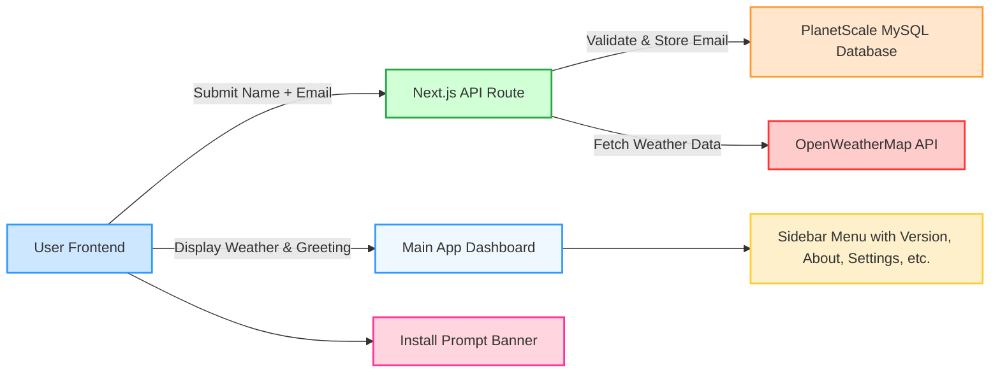

# **README.md**

````markdown
# ❄️ SkyKash Weather App ❄️

**SkyKash** is a Kashmir-inspired Progressive Web App (PWA) for weather forecasts and newsletter subscriptions. It features a modern UI/UX, immersive Kashmiri theme, email collection for newsletters, and installable app behavior.

---

## **Table of Contents**
- [Features](#features)  
- [Frontend](#frontend)  
- [Backend](#backend)  
- [Database](#database)  
- [API Endpoints](#api-endpoints)  
- [UI/UX Theme](#uiux-theme)  
- [PWA Install](#pwa-install)  
- [Error Handling](#error-handling)  
- [Architecture Diagram](#architecture-diagram)  
- [Setup Instructions](#setup-instructions)  

---

## **Features**
- Mandatory front page newsletter signup with **Name + Email**  
- Privacy policy checkbox (mandatory)  
- Name stored in **localStorage** for personalized greeting  
- Email stored in **PlanetScale MySQL** for future newsletter use  
- Main weather app with **Kashmir-inspired UI/UX**  
- Menu with:  
  - Version  
  - About App  
  - About Developer  
  - Contact Us  
  - Settings (toggle dark/light mode, units, etc.)  
  - Disclaimer  
  - Privacy Policy  
- PWA install prompt after 6 seconds with dismiss option  
- Install option inside Settings menu  
- Responsive design for mobile and desktop  
- Error handling for API calls and invalid input  

---

## **Frontend**
- **Framework:** React / Next.js  
- **Styling:** Tailwind CSS (Kashmir-inspired colors: soft blues, whites, greens)  
- **Components:**  
  - Mandatory front page form (Name + Email + Privacy Checkbox)  
  - Main app dashboard (weather info, greetings)  
  - Menu / Sidebar  
  - Install prompt banner  

---

## **Backend**
- **API Routes:** Next.js serverless functions on Vercel  
- **Responsibilities:**  
  - Accept email submissions  
  - Validate email format  
  - Store email in PlanetScale MySQL database  
- **Error Handling:**  
  - Invalid email → return 400 with message  
  - Database errors → return 500 with message  
- **Future-ready:** can extend to save user preferences or send newsletters  

---

## **Database**
- **Type:** PlanetScale MySQL (free tier)  
- **Tables:**  
```sql
CREATE TABLE subscribers (
    id INT AUTO_INCREMENT PRIMARY KEY,
    email VARCHAR(255) UNIQUE NOT NULL,
    created_at TIMESTAMP DEFAULT CURRENT_TIMESTAMP
);
````

* Stores **emails only**; user name is stored locally in browser for greeting.

---

## **API Endpoints**

| Endpoint         | Method | Request Body                      | Response                                     | Description                                      |
| ---------------- | ------ | --------------------------------- | -------------------------------------------- | ------------------------------------------------ |
| `/api/subscribe` | POST   | `{ "email": "user@example.com" }` | `{ "message": "Email saved successfully!" }` | Save user email in database                      |
| `/api/weather`   | GET    | `{ "city": "Srinagar" }`          | JSON weather data                            | Fetch weather from external API (OpenWeatherMap) |

> Additional endpoints can be added for user preferences, newsletter sending, etc.

---

## **UI/UX Theme**

* Inspired by **Kashmir’s natural beauty**:

  * Mountains, rivers, snow animations
  * Soft gradient backgrounds: blue, white, green
  * Elegant fonts (Lato, Poppins)
  * Smooth transitions and animated weather icons
* **Responsive and immersive experience** for desktop & mobile

---

## **PWA Install Behavior**

* Install prompt automatically appears **6 seconds** after first visit
* Banner includes **Install** button and **Dismiss (×)**
* Prompt **does not show again** after installation or dismissal
* Users can manually trigger install from **Settings menu**

---

## **Error Handling**

* Invalid email → form validation on frontend & backend
* API/database errors → proper JSON responses
* LocalStorage fallback if backend fails
* UI feedback for success/failure messages

---

## **Architecture Diagram (Mermaid)**



---

## **Setup Instructions**

1. Clone the repository
2. Install dependencies:

```bash
npm install
```

3. Create `.env` file with:

```env
DATABASE_URL=your-planetscale-connection-string
NEXT_PUBLIC_WEATHER_API_KEY=your-openweathermap-api-key
```

4. Deploy on **Vercel**
5. Ensure **PWA manifest.json** and service worker are configured for install prompts

---

## **Future Enhancements**

* Dark/Light mode toggle in settings
* Hourly and daily weather forecast cards
* Newsletter sending using Mailjet / Sendinblue
* Optional login system for personalized settings

---

## **App Name**

* **SkyKash** → unique, catchy, memorable, fits Kashmir-inspired weather app theme

---

## **License**

* MIT License (or your preferred license)

```

---

This README includes:  
- Full app overview  
- Endpoints  
- Backend & frontend explanation  
- Database schema  
- PWA install details  
- Error handling  
- Kashmir-inspired UI/UX description  
- Mermaid architecture diagram  

---

If you want, once you save this README in your project, we can **use it as the blueprint to generate the full working code**—frontend + backend + database + PWA features—with SkyKash UI.  

Do you want me to proceed with generating the **full code next**?
```
